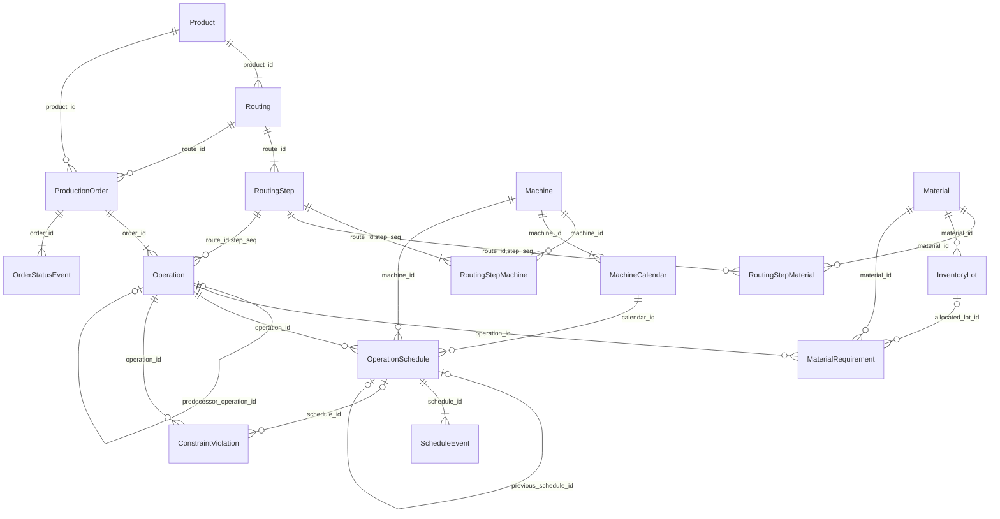

# Entity-Relationship Diagram

```mermaid
erDiagram
    Product ||--|{ Routing : "product_id"
    Product ||--o{ ProductionOrder : "product_id"
    Routing ||--|{ RoutingStep : "route_id"
    Routing ||--o{ ProductionOrder : "route_id"
    RoutingStep ||--|{ RoutingStepMachine : "route_id,step_seq"
    Machine ||--o{ RoutingStepMachine : "machine_id"
    RoutingStep ||--o{ RoutingStepMaterial : "route_id,step_seq"
    Material ||--o{ RoutingStepMaterial : "material_id"
    Machine ||--|{ MachineCalendar : "machine_id"
    Material ||--o{ InventoryLot : "material_id"
    ProductionOrder ||--|{ Operation : "order_id"
    RoutingStep ||--o{ Operation : "route_id,step_seq"
    Operation |o--o| Operation : "predecessor_operation_id"
    Operation ||--o{ MaterialRequirement : "operation_id"
    Material ||--o{ MaterialRequirement : "material_id"
    InventoryLot |o--o{ MaterialRequirement : "allocated_lot_id"
    Operation ||--o{ OperationSchedule : "operation_id"
    Machine ||--o{ OperationSchedule : "machine_id"
    MachineCalendar ||--o{ OperationSchedule : "calendar_id"
    OperationSchedule |o--o| OperationSchedule : "previous_schedule_id"
    OperationSchedule ||--|{ ScheduleEvent : "schedule_id"
    ProductionOrder ||--|{ OrderStatusEvent : "order_id"
    Operation ||--o{ ConstraintViolation : "operation_id"
    OperationSchedule |o--o{ ConstraintViolation : "schedule_id"
```
